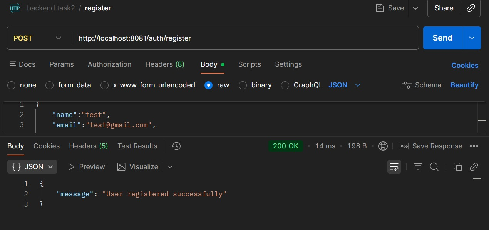
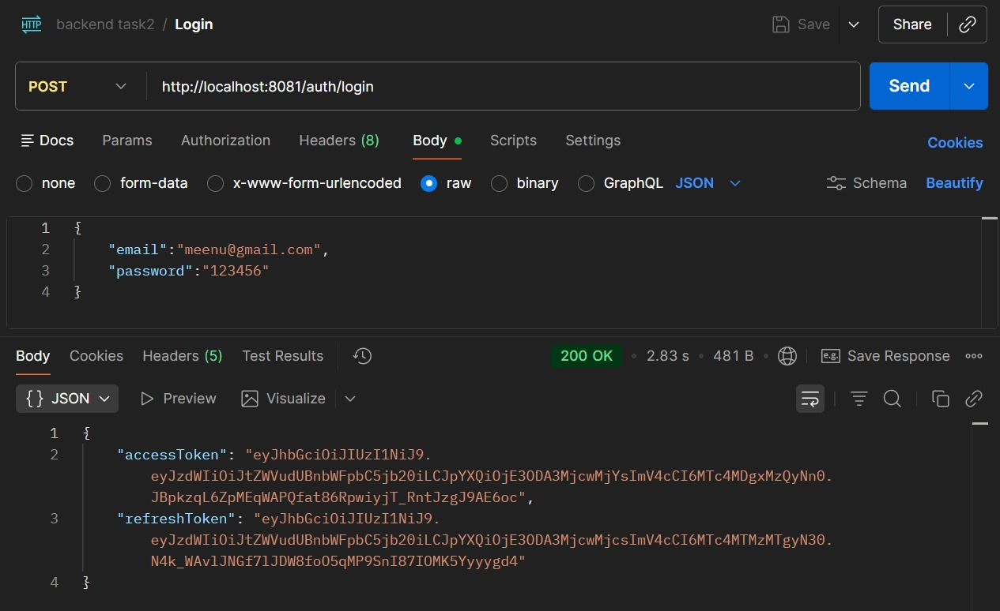
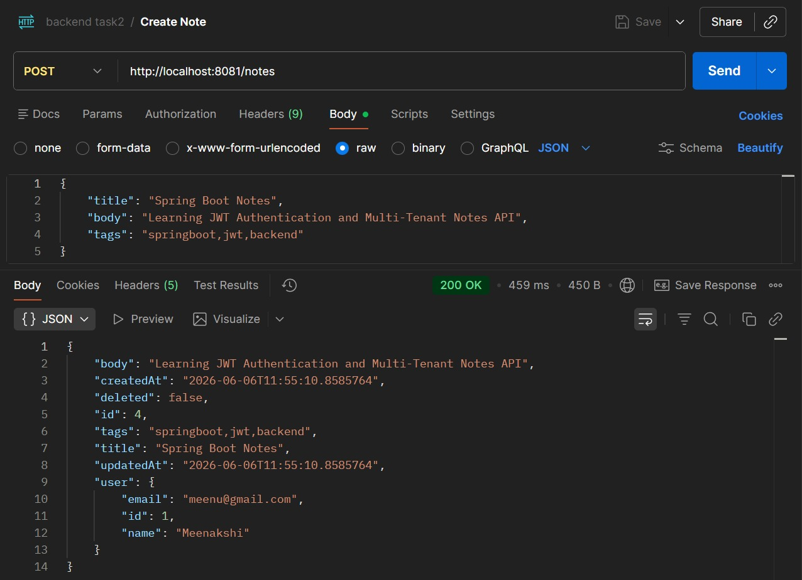
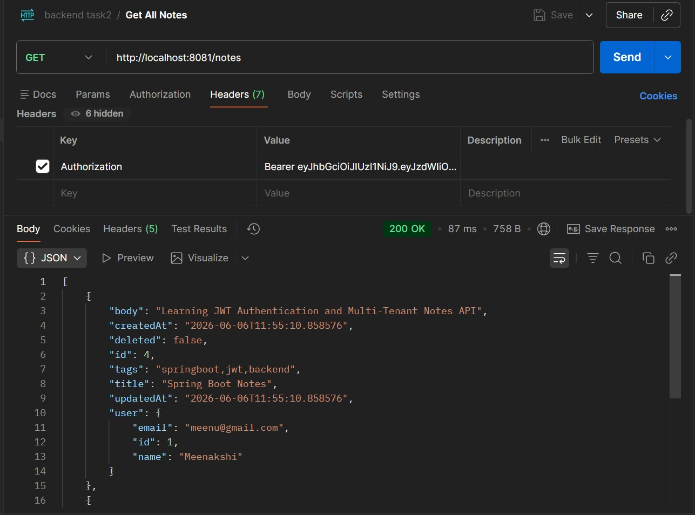
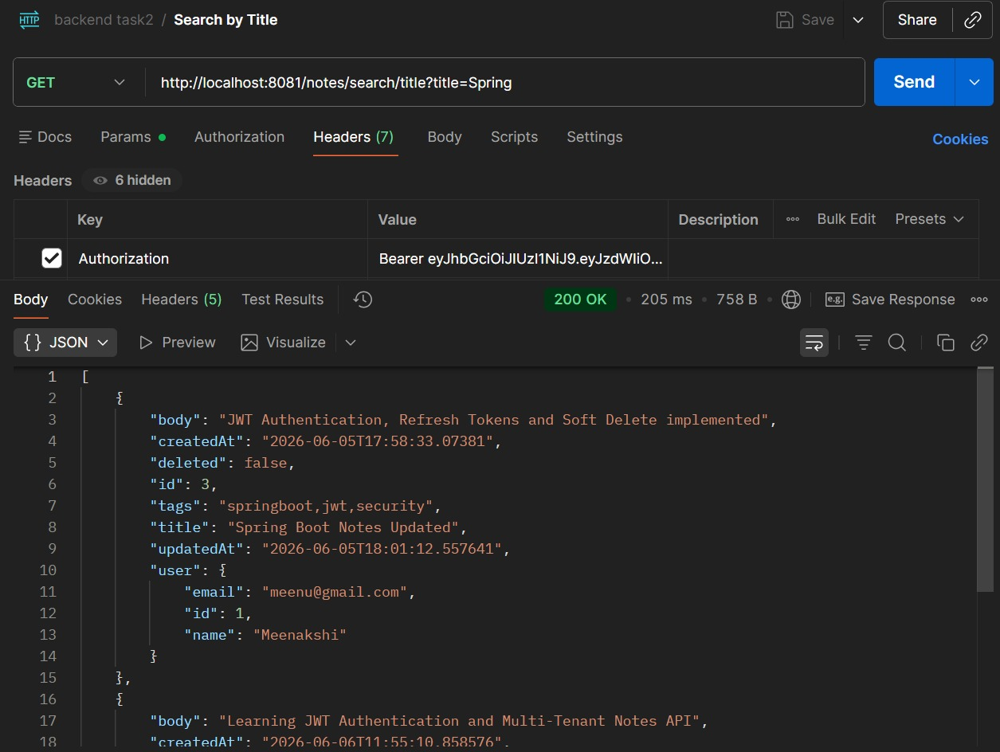
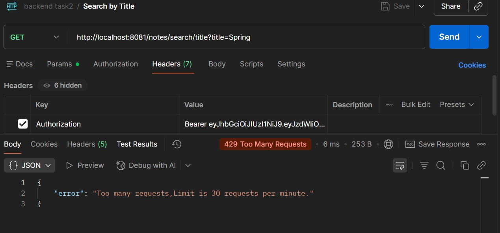
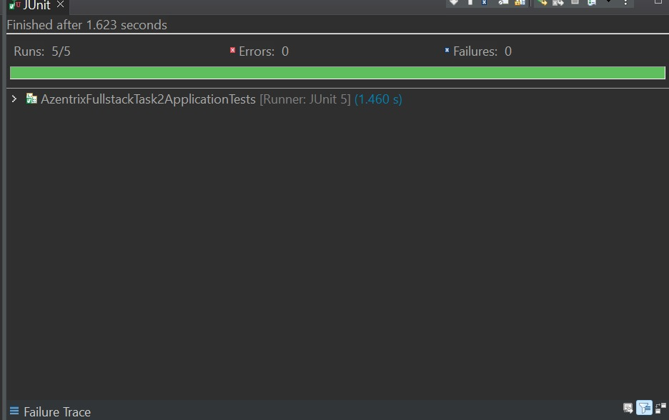
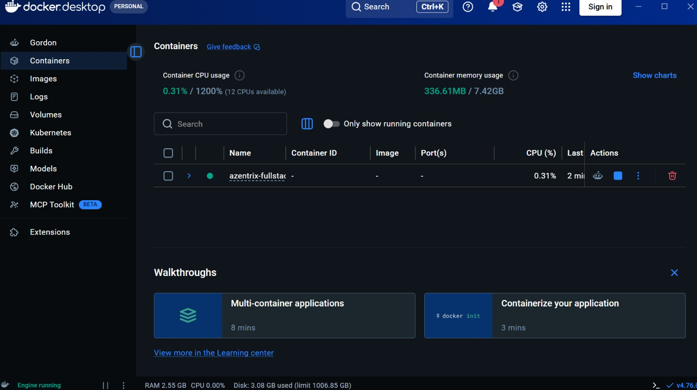

# Azentrix Fullstack Task 2 - Multi-Tenant Notes API

## Overview

A secure Multi-Tenant Notes API built using Spring Boot, PostgreSQL, JWT Authentication, Rate Limiting, and Docker.

This application allows users to securely manage personal notes with complete data isolation, token-based authentication, note recovery through soft delete, and protection against abuse through rate limiting.

---

## Features

### Authentication

* User Registration
* User Login
* JWT Access Token
* JWT Refresh Token
* Refresh Token Endpoint

### Notes Management

* Create Notes
* View Notes
* Update Notes
* Delete Notes (Soft Delete)
* Restore Deleted Notes
* Permanently Delete Notes

### Search

* Search Notes by Title
* Search Notes by Tags

### Security

* JWT Authentication
* Multi-Tenant User Isolation
* Rate Limiting (30 Requests Per Minute Per User)

### Docker Support

* Dockerfile Included
* Docker Compose Support
* Environment Variable Configuration

---

## Tech Stack

* Java 21
* Spring Boot
* Spring Data JPA
* PostgreSQL
* JWT (JJWT)
* Bucket4j
* Docker
* Docker Compose
* Maven
* JUnit 5

---

## API Endpoints

### Authentication APIs

| Method | Endpoint         | Description          |
| ------ | ---------------- | -------------------- |
| POST   | `/auth/register` | Register User        |
| POST   | `/auth/login`    | Login User           |
| POST   | `/auth/refresh`  | Refresh Access Token |

### Notes APIs

| Method | Endpoint                          | Description             |
| ------ | --------------------------------- | ----------------------- |
| POST   | `/notes`                          | Create Note             |
| GET    | `/notes`                          | Get All Notes           |
| PUT    | `/notes/{id}`                     | Update Note             |
| DELETE | `/notes/{id}`                     | Move Note To Trash      |
| GET    | `/notes/trash`                    | View Trash              |
| PUT    | `/notes/restore/{id}`             | Restore Note            |
| DELETE | `/notes/permanent/{id}`           | Permanently Delete Note |
| GET    | `/notes/search/title?title=value` | Search By Title         |
| GET    | `/notes/search/tag?tag=value`     | Search By Tag           |

---

## Rate Limiting

The application enforces:

```text
30 Requests Per Minute Per User
```

When exceeded:

```http
429 Too Many Requests
```

---

## Running Locally

### Clone Repository

```bash
git clone https://github.com/YMeenakshi23/azentrix-fullstack-task2.git
```

### Navigate To Project

```bash
cd azentrix-fullstack-task2
```

### Run Application

```bash
mvn spring-boot:run
```

Application runs on:

```text
http://localhost:8081
```

---

## Docker Setup

### Build And Run

```bash
docker compose up --build
```

### Run In Background

```bash
docker compose up -d
```

### Stop Containers

```bash
docker compose down
```

---

## Environment Variables

Create a `.env` file using `.env.example`.

Example:

```env
DB_HOST=localhost
DB_PORT=5432
DB_NAME=notes_db
DB_USERNAME=your_username
DB_PASSWORD=your_password

JWT_SECRET=your_jwt_secret

JWT_ACCESS_EXPIRATION_MS=86400000
JWT_REFRESH_EXPIRATION_MS=604800000

SERVER_PORT=8081
```

---

## Testing

The project includes Unit and Integration Tests covering:

* Registration
* Login
* Create Note
* Search Notes
* Delete Notes
* Restore Notes

Sample Result:

```text
Tests Run: 5
Passed: 5
Failed: 0
```

---

## Screenshots

### User Registration



### User Login (Access + Refresh Token)



### Create Note



### Get All Notes



### Search Notes



### Rate Limiting (429 Too Many Requests)



### JUnit Tests Passed



### Docker Containers Running



---

## Project Structure

```text
src
├── controller
├── dto
├── entity
├── repository
├── security
├── service
└── test

screenshots
Dockerfile
docker-compose.yml
.env.example
pom.xml
README.md
```

---

## Author

**Meenakshi Yakkala**

GitHub: https://github.com/YMeenakshi23

---

## Submission Checklist

* [x] JWT Authentication
* [x] Refresh Token Flow
* [x] Multi-Tenant Notes API
* [x] CRUD Operations
* [x] Search Functionality
* [x] Rate Limiting
* [x] Soft Delete & Restore
* [x] Unit/Integration Tests
* [x] Dockerized Application
* [x] PostgreSQL Integration
* [x] Environment Configuration
